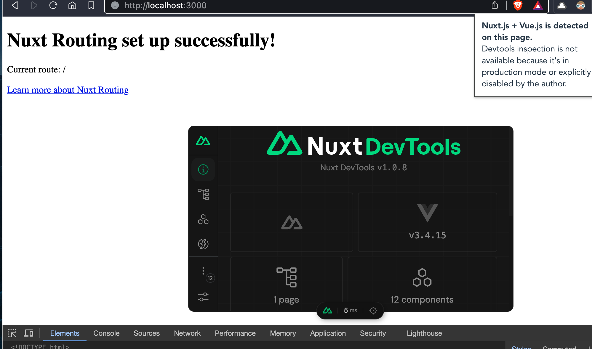

# Nuxt 3 Minimal

This is a temporal project to reproduce an issue with Vue Devtools in Nuxt project.

Install and run Nuxt in dev mode:

```bash
npm install
npm run dev
```

Open the browser:

```bash
open http://localhost:3000
```

**Problem**: Vue Devtools extension is disabled :(



```bash
npx nuxi info
```

```
- Operating System: `Darwin`
- Node Version:     `v20.11.0`
- Nuxt Version:     `3.9.3`
- CLI Version:      `3.10.0`
- Nitro Version:    `2.8.1`
- Package Manager:  `npm@10.2.4`
- Builder:          `-`
- User Config:      `devtools`, `modules`
- Runtime Modules:  `@pinia/nuxt@0.5.1`
- Build Modules:    `-`
```
