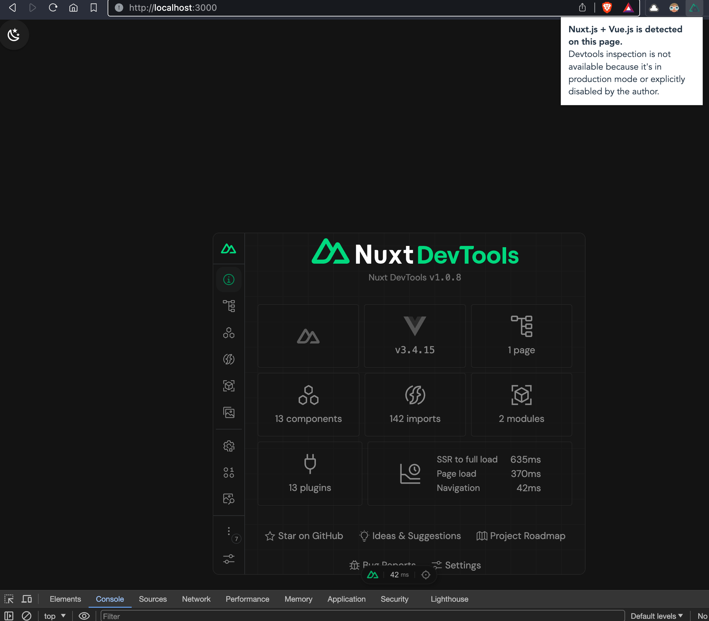

# Nuxt 3 Minimal

This is a temporal project to reproduce an issue with Vue Devtools in Nuxt project.

**UPDATE**: the problem was solved. See the Updates section below.

Install and run Nuxt in dev mode:

```bash
npm install
npm run dev
```

Open the browser:

```bash
open http://localhost:3000
```

**Problem**: Vue Devtools extension is disabled :(



```bash
npx nuxi info
```

```
- Operating System: Darwin
- Node Version:     v20.11.0
- Nuxt Version:     3.9.3
- CLI Version:      3.10.0
- Nitro Version:    2.8.1
- Package Manager:  npm@10.2.4
- Builder:          -
- User Config:      devtools, build, modules, vite
- Runtime Modules:  (), @pinia/nuxt@0.5.1, @pinia-plugin-persistedstate/nuxt@1.2.0, @nuxt/devtools@1.0.8
- Build Modules:    -
```

## Updates

* Add persistent Pinia store

* Issue resolved! The problem stemmed from an outdated version of Vue Devtools that Google Chrome and Brave had detected. The solution was to download and install the extension directly from the official website: https://devtools.vuejs.org/guide/installation.html

* Added Vuetify, Pinia store and ToggleDarkMode component

